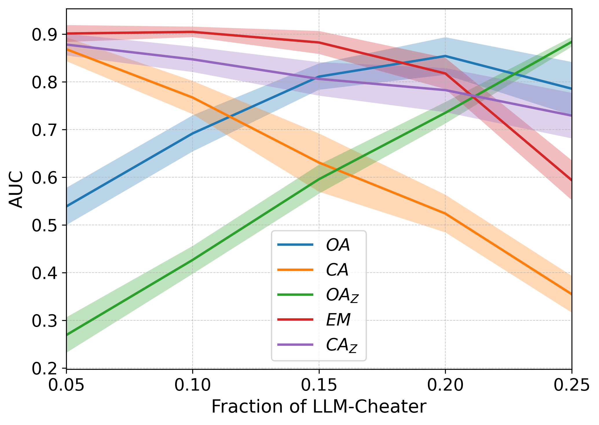

<table>
  <tr>
    <td align="center">
       
      <strong>Figure 1</strong>
    </td>
    <td align="center">
       
      <strong>Figure 2</strong>
    </td>
  </tr>
  <tr>
    <td align="center">
       
      <strong>Figure 3</strong>
    </td>
    <td align="center">
       
      <strong>Figure 4</strong>
    </td>
  </tr>
</table>

<em>The plots for AUC for 4 methods</em>

